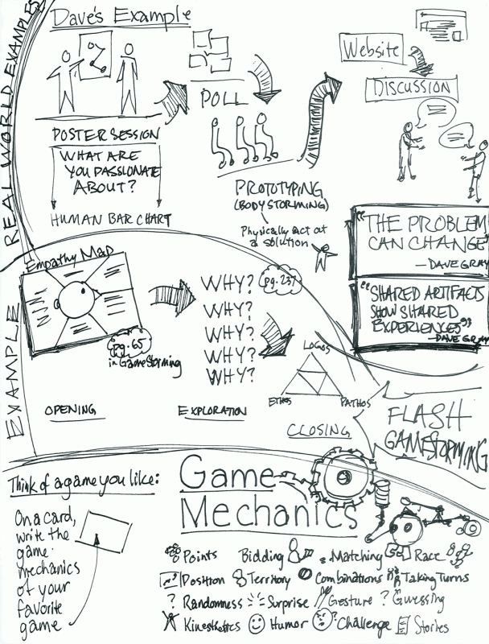

# Overview

The first step is to have a place to keep track of all of your awesome ideas. Notebooks are great for that. In this course, I'm going to ask you to work on developing the **habit** of taking notes. That will take practice…

Start every day by picking up your notebook. Then take a few minutes to review your notes and get a page started for today.

<!-- Don't edit links here, change them in _data/assignment.yml instead, -->

[slides]: <{{site.data.assignment.slides}}>
[template]: <{{site.data.assignment.template}}>
